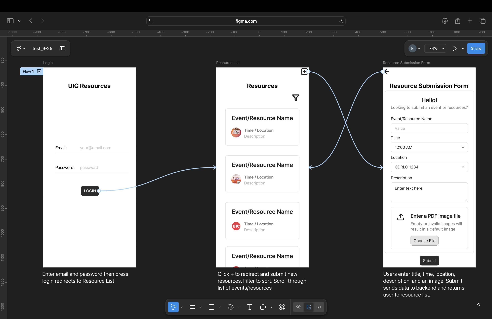

**Project Title:** UIC Resources  
**Purpose:** A platform for UIC students to view and submit campus events or resources. To encourage and promote campus engagement, also streamlining access to relevant events.  
  
**Screenshot:** 
**Link:** [Figma Link](https://www.figma.com/design/UqmX6GC8qPerUPUxcWIAu0/test_9-25?node-id=0-1&t=pXkpuvzhAOSGgXkd-1). 
  
**Layout/Flow/Pattern Explanation:**  
- Minimal 3-screen app structure with simple flow to ensure easy navigation: Login -> Resource List -> Resource Submission Form  
- Resource list has vertical scroll for readability  
- Top-right "+" icon used to add more events/resources  
- Return to list after submission for simplicity  
- Designed so students can have quick and easy access to event info or submission process  
  
**Assumptions/Limitations/Questions:**  
- Login authentication is mocked in the wireframe  
- The submit form UI does not submit data to backend  
- File upload also not storing in backend  
- Should admins be able to approve/deny submissions or autmoatic approval?  
  
**Improvements:**  
- Add filtering by date, location, alphabetical order  
- Implement edit/delete functionality for users to modify their event submissions  